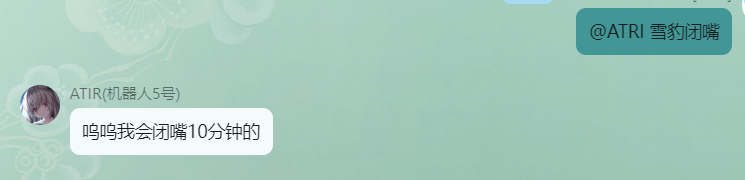
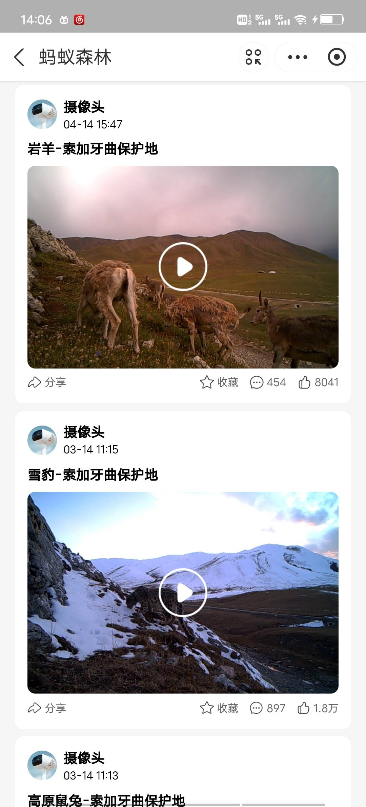
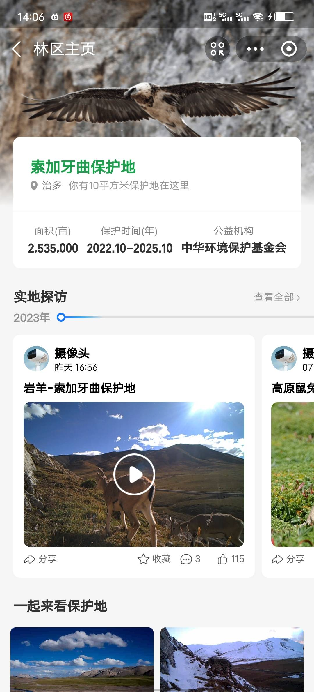

<!-- markdownlint-disable MD026 MD031 MD033 MD036 MD041 MD047 -->

<div align="center">

<a href="https://v2.nonebot.dev/store">
  
</a>

<p>
  
</p>

# NoneBot-Plugin-Shutup

_✨ ~~雪豹闭嘴~~ ✨_


<a href="https://pdm.fming.dev">
  
</a>
<a href="https://jq.qq.com/?_wv=1027&k=HdjoCcAe">
  
</a>

<br />

<a href="./LICENSE">
  
</a>
<a href="https://pypi.python.org/pypi/nonebot-plugin-shutup">
  
</a>
<a href="https://pypi.python.org/pypi/nonebot-plugin-shutup">
  
</a>

</div>

## 使用

在群里艾特机器人+`雪豹闭嘴` ,即可使机器人暂时屏蔽群内主动响应，任意适配器都可以使用。


**仅限主动信息响应屏蔽，如果是其他插件的主动信息功能是无法屏蔽的，例如定时任务**

## 💿 安装

以下提到的方法 任选**其一** 即可

<details open>
<summary>[推荐] 使用 nb-cli 安装</summary>
在 nonebot2 项目的根目录下打开命令行, 输入以下指令即可安装

```bash
nb plugin install nonebot-plugin-shutup
```

</details>

<details>
<summary>使用包管理器安装</summary>
在 nonebot2 项目的插件目录下, 打开命令行, 根据你使用的包管理器, 输入相应的安装命令

<details>
<summary>pip</summary>

```bash
pip install nonebot-plugin-shutup
```

</details>
<details>
<summary>pdm</summary>

```bash
pdm add nonebot-plugin-shutup
```

</details>
<details>
<summary>poetry</summary>

```bash
poetry add nonebot-plugin-shutup
```

</details>
<details>
<summary>conda</summary>

```bash
conda install nonebot-plugin-shutup
```

</details>

打开 nonebot2 项目根目录下的 `pyproject.toml` 文件, 在 `[tool.nonebot]` 部分的 `plugins` 项里追加写入

```toml
[tool.nonebot]
plugins = [
    # ...
    "nonebot_plugin_shutup"
]
```

</details>

## ⚙️ 配置

插件开箱即用，所有配置项皆为可选。请**按需添加**下面的配置项到 `.env` 文件中

|        配置项        | 必填 | 默认值  |     类型  |    说明   |
| :------------------: | :--: | :-----: |  :-------: | :---------------------------: |
| `shutup_tome` |  否  |   True   | bool |    是否需要艾特,设置为`False`则无需艾特   |
|  `shutup_name`  |  否  |   []   | List[str] |  需要名称，例如`xx闭嘴`        |
| `shutup_time`  |  否  | `10` | int | 闭嘴时间，单位分钟 |
| `shutup_permission` |  否  | ["超管"] | List[str]  |    默认只响应超管，如果需要所有人都能使用，设置为空列表[]    |

## 不建议

不建议和以下插件混用,因为功能重复

- [指令阻断](https://github.com/KarisAya/nonebot_plugin_matcher_block)
- [黑名单](https://github.com/MerCuJerry/nonebot-plugin-blocker)

## 其他

- ~~[丁真同款电子烟](http://dian-zi-yan.com/index-cn.html)~~
- [爱发电](https://afdian.net/a/agnes_digital)
- [支付宝-蚂蚁森林-保护雪豹(手机打开)](https://render.alipay.com/p/s/i/?scheme=alipays%3A%2F%2Fplatformapi%2Fstartapp%3FappId%3D60000002%26url%3Dhttps%253A%252F%252Frender.alipay.com%252Fp%252Fyuyan%252F180020380000000248%252Fforest_home.html%253FcaprMode%253Dsync%2526forestId%253D4700082%26pullRefresh%3DNO%26canPullDown%3DNO%26backgroundColor%3D1381653%26transparentTitle%3Dauto%26source%3Dfxshexiangtoubaohudi%26fxzjshareChinfo%3Dch_share__chsub_CopyLink%26chInfo%3Dch_share__chsub_CopyLink%26apshareid%3D85c04233-69a5-4394-bd57-8d1c67a240f0%26shareBizType%3DztokenV0_kMglUpIE) 以下是作者保护雪豹的截图
 